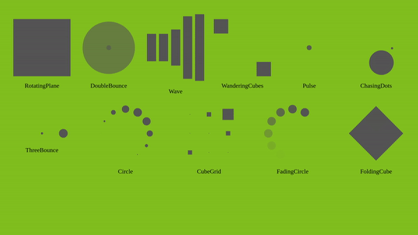

## react-spin-kit


Simple wrapper for [spin-kit](https://github.com/tobiasahlin/SpinKit) in ReactJS.

## usage
There are currently 11 spinners : 
- RotatingPlane
- DoubleBounce
- Wave
- WanderingCube
- Pulse
- ChasingDots
- ThreeBounce
- Circle
- CubeGrid
- FadingCircle
- FoldingCube

```js
import React from 'react';

const Hello = () => {
    return (
        <RotatingPlane
            size={150}
            color="#82c020"
            style={{
                ...
            }}
        />
    )
};

export default Hello;
```

The size props is given in px and define the width of the spinner (its height is automatically calculated). (default 50px)

The color props is given in HEX and define the spinner's color. (default #fff)

You can also pass style (or use styled-components) BUT you can not modify width, height and display. If you try to modify one of these three properties, they will be ignored.

## Notes
For the CubeGrid spinner, the size passed as props is the actual size of the container. The spinner's size itself could vary by 2px (it require a modulo 3 width).

The size passed to FoldingCube is the actual wrapper size (rect diagonal is calculated).
